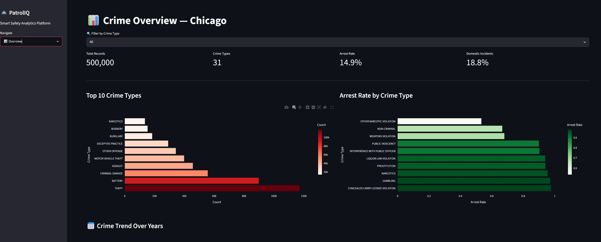
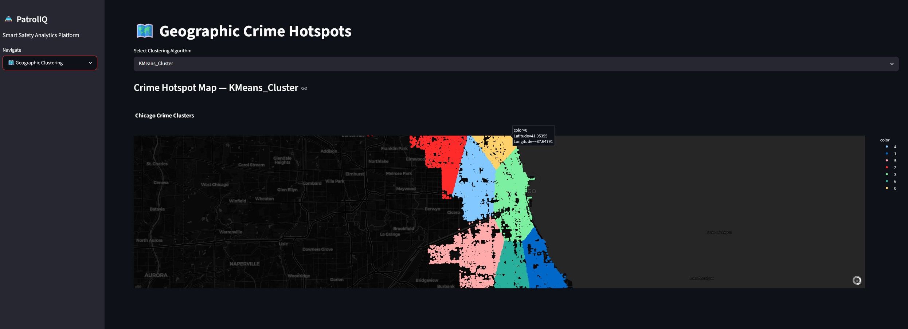
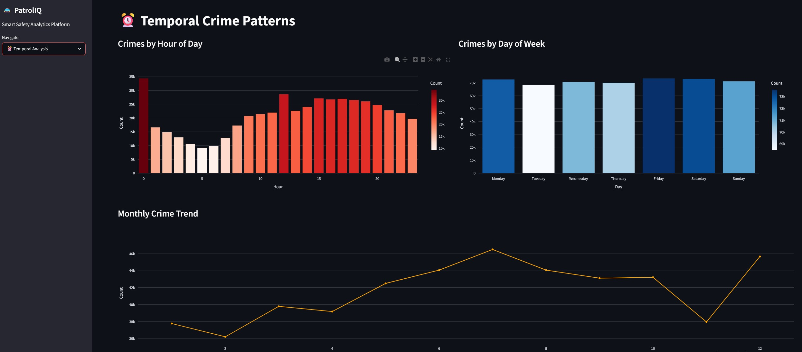
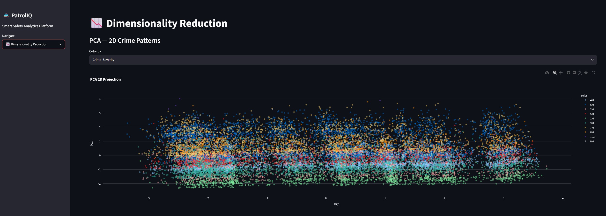
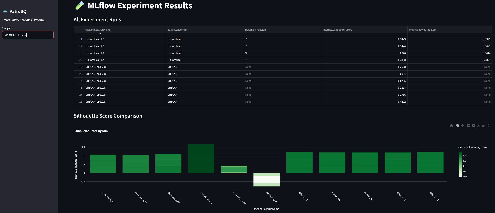

# 🚔 PatrolIQ — Smart Safety Analytics Platform

> A comprehensive urban crime intelligence platform leveraging unsupervised machine learning to analyze crime patterns and optimize police resource allocation across Chicago.

[](https://patroliq-6aaactck2qqtdfwpqn9hi8.streamlit.app/)

## 🔗 Live App

**👉 [Click here to open PatrolIQ](https://patroliq-6aaactck2qqtdfwpqn9hi8.streamlit.app/)**

---

## 📌 Overview

PatrolIQ analyzes 500,000 Chicago crime records using clustering and dimensionality reduction techniques to identify crime hotspots, uncover temporal patterns, and deliver actionable insights for law enforcement agencies.



---

## 🧠 Tech Stack

| Layer | Tools |
|---|---|
| Data Processing | Python, Pandas, NumPy |
| Machine Learning | Scikit-learn (KMeans, DBSCAN, Hierarchical, PCA, t-SNE) |
| Experiment Tracking | MLflow |
| Visualization | Plotly, Seaborn, Matplotlib |
| Web Application | Streamlit |
| Deployment | Streamlit Cloud |
| Data Hosting | Hugging Face Datasets |

---

## 📂 Dataset

- **Source:** [Chicago Data Portal — Crimes 2001 to Present](https://data.cityofchicago.org/Public-Safety/Crimes-2001-to-Present/ijzp-q8t2)
- **Full Dataset:** 7.8 Million records (2001–2025)
- **Sample Used:** 500,000 most recent clean records
- **Features:** 22 variables including location, time, crime type, arrest status
- **Crime Categories:** 33 distinct types

---

## ⚙️ Project Pipeline

```
Chicago Crime Dataset (7.8M Records)
        ↓
Download and Sample (500K Records)
        ↓
Data Quality Assessment & Preprocessing
        ↓
Feature Engineering & Exploratory Analysis
        ↓
Clustering Analysis (Geographic + Temporal)
        ↓
Dimensionality Reduction (PCA + t-SNE)
        ↓
MLflow Experiment Tracking
        ↓
Streamlit Application Development
        ↓
Cloud Deployment
```

---

## 🗺️ Geographic Crime Clustering

Three clustering algorithms applied to latitude/longitude coordinates to identify crime hotspots across Chicago districts.



| Algorithm | Silhouette Score | Davies-Bouldin |
|---|---|---|
| K-Means (K=7) | 0.40 | 0.80 |
| DBSCAN (eps=0.08) | 0.07 | — |
| **Hierarchical (K=5)** | **0.53** | **0.75** |

✅ **Best Model:** Hierarchical Clustering K=5 (Silhouette > 0.5 target achieved)

---

## ⏰ Temporal Crime Patterns



Key findings:
- Peak crime hours: **10 PM – 2 AM**
- Highest crime day: **Friday**
- Most active season: **Summer**
- Theft and Battery dominate across all time periods

---

## 📉 Dimensionality Reduction



- **PCA:** Reduced 22 features to 3 principal components capturing 70%+ variance
- **PC1** (~30% variance) — driven by geographic location features
- **t-SNE:** Applied on 20K sample to visualize high-dimensional crime cluster separation

---

## 🧪 MLflow Experiment Tracking



All clustering experiments tracked with:
- Silhouette Score
- Davies-Bouldin Index
- Number of clusters
- Noise percentage (DBSCAN)

---

## 🚀 Run Locally

```bash
# Clone the repo
git clone https://github.com/rameshkrishna-sys/PatrolIQ.git
cd PatrolIQ

# Create virtual environment
python -m venv venv
venv\Scripts\activate

# Install dependencies
pip install -r requirements.txt

# Run the app
streamlit run app.py
```

---

## 📁 Project Structure

```
PatrolIQ/
├── app.py                  ← Streamlit web application
├── requirements.txt        ← Python dependencies
├── mlflow.db               ← MLflow experiment database
├── images/                 ← App screenshots
│   ├── overview.png
│   ├── geographic.png
│   ├── temporal.png
│   ├── pca.png
│   └── mlflow.png
└── Notebook/
    ├── 01_load_and_sample.ipynb
    ├── 02_preprocessing.ipynb
    ├── 03_clustering.ipynb
    ├── 04_dimensionality_reduction.ipynb
    └── 05_mlflow_tracking.ipynb
```

---

## 👤 Author

**Ramesh Krishna**
- GitHub: [@rameshkrishna-sys](https://github.com/rameshkrishna-sys)

---

## 📄 License

This project is licensed under the MIT License.
